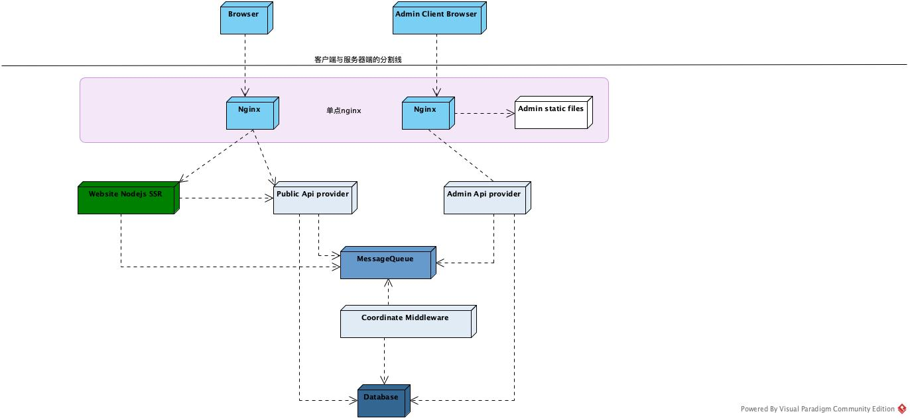

README
======

FAQ:
----

Q:这个工程是干什么用的？
A：作者在做一个装修公司的官网，项目设涉及到多个子项目，该项目是总项目的入口。包含项目引导、基本文档说明等。一些总的设计性代码、文件也会放在这个工程下。

Q:我该怎么上手
A: 「TODO」

Q：项目使用了哪些技术，以及技术选型的原因吗？
A：「TODO」

系统架构
-------

先上个图，后面再补说明
 

子模块
------
「TODO」
- 网站前端工程
- 网站接口工程
- 管理前端代码
- 管理接口工程
- 协调中间件工程

LISENCE
-------
「TODO」